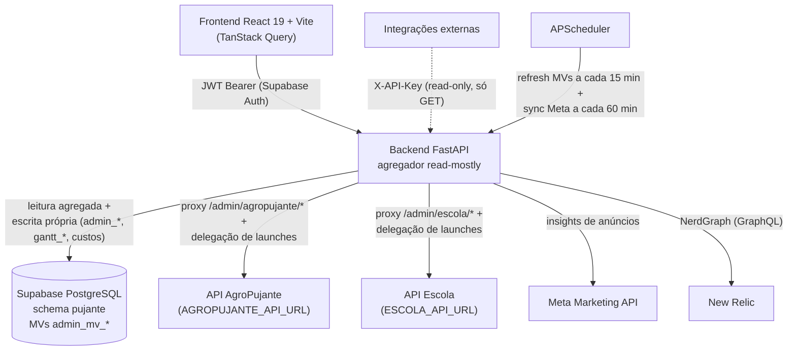

O backend do Pujante Admin é um **agregador**: ele não é dono dos dados dos produtos, mas lê de todas as fontes e consolida. A escrita que pertence aos produtos é delegada por HTTP.

## Visão geral

## Fontes de dados

<CardGroup cols={2}>
  <Card title="Supabase — schema pujante" icon="database">
    Conexão direta ao PostgreSQL do Supabase usando a service role. Toda leitura agregada e toda escrita própria do Admin acontecem no schema `pujante`.
  </Card>
  <Card title="Backends dos produtos" icon="arrows-left-right">
    Proxy HTTP e delegação de escrita para as APIs do AgroPujante (`AGROPUJANTE_API_URL`) e da Escola (`ESCOLA_API_URL`).
  </Card>
  <Card title="Meta Marketing API" icon="bullhorn">
    Métricas de anúncios (spend, compras, ROAS, criativos), sincronizadas periodicamente para o banco.
  </Card>
  <Card title="New Relic NerdGraph" icon="wave-pulse">
    Métricas, erros e logs das aplicações Site e Escola via GraphQL (USER API key).
  </Card>
</CardGroup>

### O que vive no schema `pujante`

| Grupo | Objetos | Papel |
|---|---|---|
| Materialized views | `admin_mv_*` (DAU/MAU diário, financeiro MRR/ARR, assinantes) | Leitura rápida para os dashboards |
| Tabelas do Admin | `admin_tickets`, `admin_reunioes`, `admin_activity_log`, `admin_api_keys`, `admin_panel_members`, `admin_users`, `cobranca_notes`, `custos` | Operação interna do painel (escrita direta) |
| Tabelas do Gantt | `gantt_teams`, `gantt_persons`, `gantt_macros`, `gantt_subs`, `gantt_macro_members`, `gantt_events` | Gestão do time (escrita direta) |
| Tabelas dos produtos | Tabelas do Site (AgroPujante) e da Escola | Somente leitura agregada |

## Proxy HTTP para os backends

Os endpoints `/admin/escola/{path}` e `/admin/agropujante/{path}` repassam qualquer método (`GET`, `POST`, `PUT`, `PATCH`, `DELETE`) para o backend correspondente:

- Body, query string e header `Authorization` são repassados como recebidos.
- Operações de escrita geram registro **assíncrono** de auditoria em `admin_activity_log`.

Isso permite que o frontend do Admin opere recursos dos produtos sem que o Admin duplique lógica de negócio.

## Delegação de escrita: launches

O `POST /admin/launches` é o exemplo canônico de escrita delegada:

1. O Admin recebe o `CreateLaunchRequest` com o campo `origin`.
2. Roteia a chamada: `origin=site` → `AGROPUJANTE_API_URL/admin/launches`; `origin=escola` → `ESCOLA_API_URL/admin/launches`.
3. Repassa o Bearer token do usuário para o backend de destino.
4. Respeita o timeout `DELEGATION_TIMEOUT_SECONDS`.
5. Se o upstream falhar, responde **502** com o detalhe do erro.

<Warning>
O Admin nunca grava lançamentos diretamente no banco — o dono do dado é sempre o backend de origem. Se o produto rejeitar a escrita, o Admin apenas propaga o erro.
</Warning>

## Materialized views e refresh

Os dashboards mais pesados (DAU/MAU, financeiro, assinantes) leem de materialized views `admin_mv_*`, refrescadas pelo **APScheduler**:

- Refresh automático a cada `MV_REFRESH_MINUTES` (default **15**).
- `MV_REFRESH_ON_STARTUP` controla refresh no boot do serviço.
- `SCHEDULER_ENABLED` liga/desliga o scheduler como um todo.

<Warning>
Os dashboards leem das MVs — os dados podem estar **até 15 minutos defasados** (`MV_REFRESH_MINUTES`). Se precisar do dado fresco agora, force com `POST /admin/mvs/refresh`.
</Warning>

### Catálogo das MVs

MVs confirmadas nas migrations do repositório (`backend/migrations/`). Convenção: o prefixo `admin_mv_` faz a view ser auto-listada por `pujante.admin_list_materialized_views()` e entrar no refresh automático; toda MV tem UNIQUE INDEX para suportar `REFRESH CONCURRENTLY`. Staleness máxima de todas: **15 min** (`MV_REFRESH_MINUTES`).

| MV | O que agrega | Fonte |
|---|---|---|
| `admin_mv_mrr_monthly` | MRR mensal dos últimos 12 meses, por origem | `site_subscriptions` + `site_plan_prices` (Site); `subscriptions` + `subscription_payments` (Escola) |
| `admin_mv_subscribers_monthly` | Assinantes ativos no fim de cada mês, por origem | Mesmas fontes do MRR |
| `admin_mv_churn_daily` | Churn diário dos últimos 30 dias, por origem | Mesmas fontes do MRR |
| `admin_mv_cash_daily` | Caixa diário dos últimos 7 dias, por origem (só Escola popula; Site fica em 0 por design) | `subscription_payments` PAID (Escola) |
| `admin_mv_funnel_snapshot` | Funil de 5 etapas (visitante → cadastrado → trial → pro → supporter) | `post_views`, `users`/`members`, `site_subscriptions`, `subscriptions` |
| `admin_mv_user_actions_top` | 8 ações (4 Site + 4 Escola) com % de adoção em 30d | `post_likes`, `post_comments`, atividade de lessons etc. |
| `admin_mv_newsletter_daily` | Newsletter consolidada Site + Escola por dia (30d): inscritos, sent/delivered/opened/clicked/bounced | `site_newsletter_subscribers`, `newsletter_subscribers`, `email_sends` |
| `admin_mv_gateway_breakdown` | Receita PAID por gateway (Asaas/Pagar.me/Hotmart) por mês, com origem | `site_subscription_payments`, `subscription_payments`, `external_payments` |
| `admin_mv_dau_daily` | DAU por dia dos últimos 30 dias, por origem | `admin_users_v.last_seen_at` |
| `admin_mv_mau_rolling` | MAU rolling (snapshot atual, 30 dias para trás), por origem | `admin_users_v.last_seen_at` |
| `admin_mv_conversions_by_product_daily` | Signups, paid_subs e GMV por (dia, origem, utm_source, produto) | `site_subscriptions` + pagamentos + UTMs |
| `admin_mv_roas_by_channel` | Spend Meta + receita + ROAS por (dia, utm_source, origem, produto) | `meta_ads_insights` + receita por UTM |
| `admin_mv_user_lifetime_value` | LTV estimado por (usuário, origem): coorte de signup → total pago, churn | `users` + pagamentos |
| `admin_mv_page_views_daily` | Visitas (page views) por (dia, utm_source, origem) — KPI "Visitas" do Marketing | `pujante.page_views` |

<Note>
A lista viva (com `is_populated`, tamanho e `refreshed_at` de cada MV) está sempre em `GET /admin/mvs` — é a fonte de verdade caso uma migration nova adicione MVs depois desta página.
</Note>

### Refresh manual

| Método | Path | Descrição | Auth |
|---|---|---|---|
| GET | `/admin/mvs` | Lista as MVs e o status de cada uma | JWT/Key |
| POST | `/admin/mvs/refresh` | Força refresh imediato | JWT/Key |

<ParamField query="concurrent" type="boolean">
Quando `true`, executa `REFRESH MATERIALIZED VIEW CONCURRENTLY`, sem travar leituras durante o refresh.
</ParamField>

## Integrações externas

<Accordion title="Meta Marketing API">
O sync do Meta Ads roda no APScheduler a cada `META_SYNC_INTERVAL_MINUTES` (default **60**), com lookback de `META_SYNC_LOOKBACK_DAYS` dias (default **30**). A atribuição usa janela `7d_click` e, por default, só campanhas com status `ACTIVE` entram (configurável via `META_CAMPAIGN_EFFECTIVE_STATUS`). Também há sync manual via `POST /admin/meta-ads/sync` (assíncrono, responde 202).
</Accordion>

<Accordion title="New Relic NerdGraph">
A integração usa uma **USER API key** (não license key) contra a API GraphQL do NerdGraph. Os apps são mapeados por origem: `NEW_RELIC_APP_SITE` e `NEW_RELIC_APP_ESCOLA`. Sem as variáveis configuradas, os endpoints de observabilidade retornam vazio com um aviso — não quebram.
</Accordion>

## Convenções da API

Shape de erro, paginação, parâmetro `origin` e rate limiting estão centralizados em [Convenções](/admin/convencoes). OpenAPI em `/api/openapi.json` e docs interativas em `/api/docs`, protegidos por API key (abertos fora de produção).
