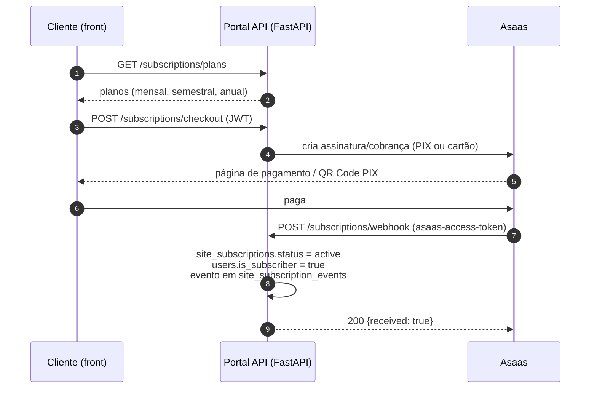
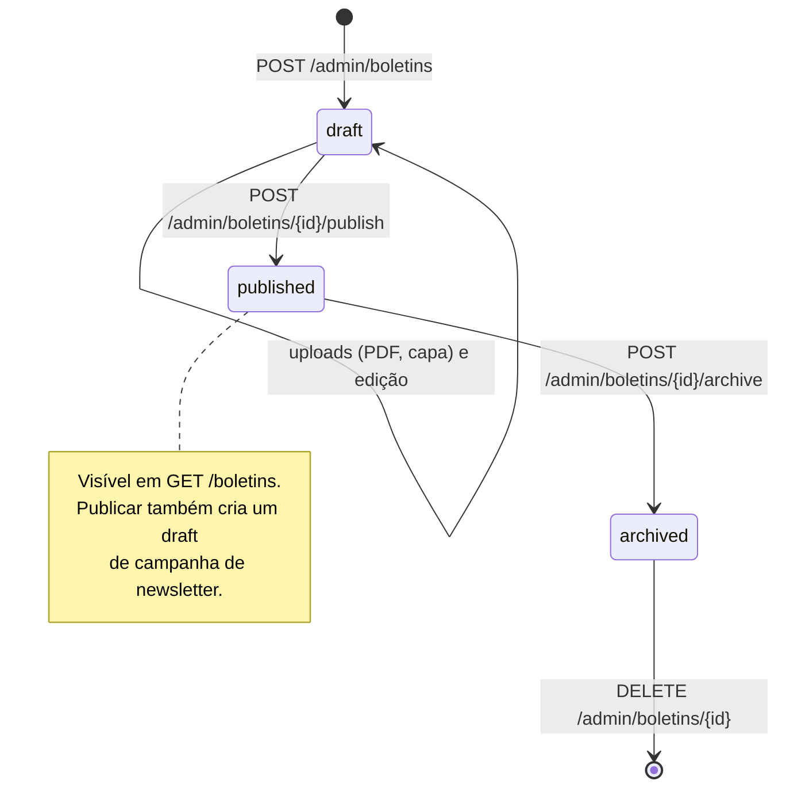

## Trial → PRO

<Steps>
  <Step title="Usuário escolhe um plano">
    `GET /subscriptions/plans` lista mensal, trimestral e anual (com desconto progressivo).
  </Step>
  <Step title="Checkout">
    `POST /subscriptions/checkout` (JWT) cria a cobrança no Asaas — PIX ou cartão (tokenizado via `POST /checkout/cards`).
  </Step>
  <Step title="Webhook Asaas confirma o pagamento">
    O Asaas chama `POST /subscriptions/webhook` (validado por `asaas-access-token`). O evento é processado direto — o Portal não mantém tabela de auditoria de webhooks; o rastro fica em `site_subscription_events`.
  </Step>
  <Step title="Assinatura ativa">
    A row em `site_subscriptions` vira `active`, `users.is_subscriber = true`, e o evento entra em `site_subscription_events`. O usuário passa a ver artigos completos, boletins inteiros e downloads de PDF.
  </Step>
</Steps>

Cancelamento: `POST /subscriptions/cancel` (JWT). O funil de trial e a receita são acompanhados em `/admin/revenue/*` (gestor+).

## Apoiador

<Steps>
  <Step title="Lead">
    O formulário público envia `POST /supporter-leads` (name, email, office, phone, message). A equipe é notificada via `LEAD_NOTIFICATION_EMAIL`.
  </Step>
  <Step title="Cadastro">
    A equipe cadastra o apoiador (ou ele fecha via `POST /supporter-checkout/checkout`, PIX ou cartão). Planos de apoiador/escritório em `GET /supporter-checkout/plans`.
  </Step>
  <Step title="Exibição pública">
    O apoiador ativo aparece na página `/apoiadores` com logo e bio (`GET /supporters`).
  </Step>
</Steps>

<Warning>
**Apoiador e PRO não coexistem** — é 1 assinatura por usuário. Um supporter ativo **já inclui acesso PRO** via `users.is_subscriber`. Não tente criar uma segunda assinatura PRO para um apoiador; use `GET /supporter-checkout/upgrade-preview` para ver as opções de upgrade.
</Warning>

## Publicação de artigo (colaborador externo)

<Steps>
  <Step title="Submission">
    O colaborador envia o artigo via `POST /submissions` (JWT) e acompanha as suas em `GET /submissions`.
  </Step>
  <Step title="Review editorial">
    A equipe é notificada (`REVIEW_NOTIFICATION_EMAIL`) e avalia. O status da submission muda via `PATCH /submissions/{id}`.
  </Step>
  <Step title="Post draft">
    Aprovado, o conteúdo vira um post em rascunho (`POST /posts`, editor+), com autores (`PUT /posts/{id}/authors`) e tags (`PUT /posts/{id}/tags`).
  </Step>
  <Step title="Published">
    O editor publica. Artigos publicados ficam sujeitos ao paywall: free vê o início com blur; notícias permanecem ilimitadas.
  </Step>
</Steps>

## Boletim

Ciclo de vida via `/admin/boletins` (admin+):

<Steps>
  <Step title="Draft">
    `POST /admin/boletins` cria o boletim; os julgados são cadastrados e um deles é marcado como `sample_julgado`.
  </Step>
  <Step title="Upload de assets">
    `POST /admin/boletins/{id}/upload-pdf` e `/upload-cover` sobem o PDF e a capa.
  </Step>
  <Step title="Publish">
    `POST /admin/boletins/{id}/publish` torna o boletim visível em `GET /boletins`.
  </Step>
</Steps>

Gating de acesso no consumo público:

| Quem | O que vê |
|---|---|
| Free / anônimo | Lista de boletins + apenas o `sample_julgado` de cada um |
| PRO (ou apoiador) | Todos os `julgados[]` no detalhe + `GET /boletins/{slug}/download` (signed URL do PDF) |

`POST /admin/boletins/{id}/archive` tira o boletim do ar sem apagar.

## Campanha de email

<Steps>
  <Step title="Draft">
    `POST /admin/newsletters` cria a campanha (conteúdo, segmento). `GET /recipients/preview` mostra quem vai receber.
  </Step>
  <Step title="Teste">
    `POST /admin/newsletters/{id}/test` envia para emails de teste; `GET /{id}/pdf` gera o preview em PDF.
  </Step>
  <Step title="Envio">
    `POST /admin/newsletters/{id}/send` enfileira para a lista (ou `/send-custom` para uma lista pontual). O envio sai pelo Resend. `POST /{id}/cancel` aborta uma fila em andamento.
  </Step>
  <Step title="Tracking">
    O webhook `POST /webhooks/resend` alimenta `email_analytics`. Acompanhe em `GET /{id}/analytics` (open/click), `/{id}/top-links` e `/{id}/ratings` (NPS).
  </Step>
</Steps>
