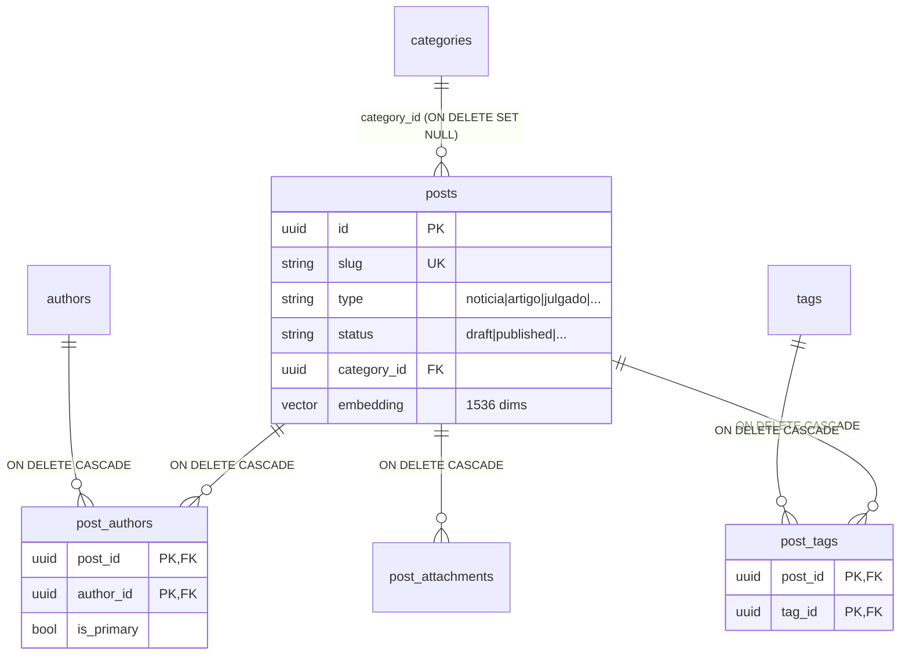
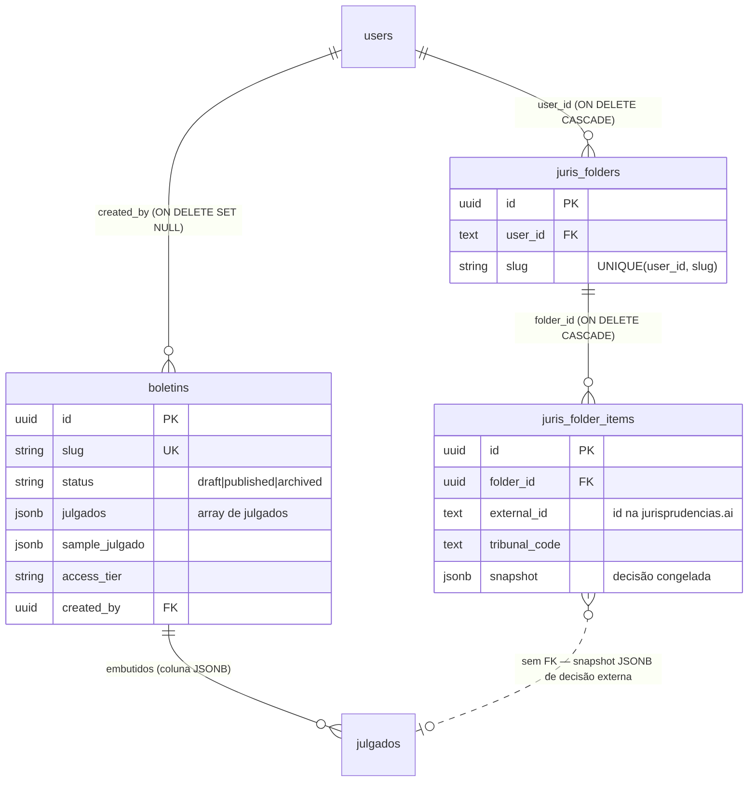

Todas as tabelas vivem no schema **`pujante`** do Supabase Postgres (não no `public`). Em qualquer acesso via PostgREST, envie `Accept-Profile: pujante`.

## Identidade (compartilhada com o ecossistema)

| Tabela | Papel no Portal |
|---|---|
| `users` | Usuários do Portal — login, `is_subscriber`, `password_hash` (bcrypt `$2b$` ou `supabase_managed`), `user_type` |
| `members` | Pessoas físicas — DDL é da Escola, mas o Portal lê/escreve em fluxos de apoiador |
| `password_reset_codes` | Códigos OTP de reset de senha |
| `profiles` | Perfil público (@handle, bio, especialidades) |
| `user_follows` | Grafo social (seguir autores/usuários) |

<Note>
`users` e `members` são as tabelas mais **compartilhadas** do schema: o Portal escreve nelas em checkout, assinaturas e revenue, e a Escola também — veja o [mapa de propriedade de tabelas](/propriedade-tabelas) antes de alterar qualquer coluna.
</Note>

## Conteúdo editorial

| Tabela | Papel |
|---|---|
| `posts` | Conteúdo central — notícia, artigo e julgado (campo de tipo), com status draft/published, slug, embedding vetorial |
| `post_authors` | N:N posts ↔ autores (coautoria) |
| `post_tags` | N:N posts ↔ tags |
| `attachments` | Anexos de posts (arquivos para download) |
| `categories` | Categorias editoriais (slug, usado em filtros) |
| `tags` | Tags livres |
| `columns` | Colunas editoriais (coluna fixa de um autor) |
| `authors` | Autores editoriais (perfil público com slug e posts) |
| `podcasts` | Episódios — sincronizados do YouTube via `youtube_video_id` (índice único) |
| `books` | Livros recomendados/curados |

<Note>
Posts do tipo **julgado** são conteúdo editorial. Não confunda com os `julgados` de boletim nem com a consulta de jurisprudência (jurisprudencias.ai) — veja a seção de jurisprudência abaixo.
</Note>

### Relacionamentos do domínio editorial

`ON DELETE` confirmados no `supabase_schema.sql`:



<Info>
Deletar um post **cascateia** vínculos N:N e anexos, mas deletar uma categoria **não** apaga posts — eles ficam com `category_id = NULL`. O nome físico da tabela de anexos é `post_attachments` (o router é `/attachments`).
</Info>

## Negócio (monetização e parceiros)

| Tabela | Papel |
|---|---|
| `supporters` | Apoiadores/escritórios ativos (logo, bio) exibidos em `/apoiadores` |
| `partners` | Parceiros institucionais |
| `banners` | Banners por posição (`hero`, `top`, `bottom`, `sidebar`) |
| `supporter_leads` | Leads do formulário de apoiador (name, email, office, phone, message) |
| `site_subscriptions` | Assinaturas PRO/apoiador (status, billing_type — inclusive `MANUAL`) |
| `site_subscription_events` | Trilha de eventos de assinatura (webhooks Asaas, mudanças de status) |
| `credit_cards` | Tokens de cartão salvos via Asaas (nunca o PAN) |

<Warning>
`site_subscriptions` (Portal) **não é** a tabela `subscriptions` (Escola). São dois sistemas de assinatura separados, com gateways, planos e ciclos distintos, no mesmo schema. Um usuário PRO do Portal não aparece em `subscriptions`, e um membro da Escola não aparece em `site_subscriptions`.
</Warning>

## Jurisprudência e boletins

| Tabela | Papel |
|---|---|
| `boletins` | Boletins (PDF curado de julgados) — draft/published/archived, capa, PDF |
| `julgados` | Julgados que compõem um boletim (um deles marcado como `sample_julgado` para usuários free) |
| `juris_folders` | Pastas pessoais do usuário para organizar decisões encontradas na consulta |
| `juris_folder_items` | Itens salvos dentro das pastas (referências a decisões dos tribunais) |

### Relacionamentos do domínio de jurisprudência

`ON DELETE` confirmados nas migrations `031_boletins_jurisprudencia.sql` e `048_juris_folders.sql`:



<Info>
Dois detalhes do schema físico que a nomenclatura da doc esconde: o nome real da tabela de boletins é **`boletins_jurisprudencia`**, e os `julgados` **não são uma tabela** — vivem como array JSONB dentro do boletim. Já `juris_folder_items` não referencia julgados por FK: guarda um **snapshot JSONB** da decisão externa (`external_id` + `tribunal_code`), de propósito, para sobreviver a mudanças de id/payload no provedor.
</Info>

## Newsletter e marketing

| Tabela | Papel |
|---|---|
| `newsletter_subscribers` | Inscritos (insert público via PostgREST) |
| `campaigns` | Campanhas de email (draft → test → send) |
| `ads` | Anúncios de newsletter (newsletter-ads) |
| `ratings` | Avaliações/NPS de campanhas |
| `email_analytics` | Eventos de entrega/abertura/clique vindos do webhook Resend |

## Administração

| Tabela | Papel |
|---|---|
| `admin_users` | Mapeamento user → role (editor, gestor, administrador) — base do RBAC |
| `api_keys` | Chaves read-only para acesso externo |
| `password_reset_codes` | OTPs de reset de senha (6 dígitos, máx. 3 tentativas) |
| `reserved_handles` | Handles reservados (não registráveis em `profiles`) |

## Perfis e social

| Tabela | Papel |
|---|---|
| `profiles` | Perfil público do usuário (handle, headline, bio, specialties, view_mode) |
| `user_follows` | Relação de seguir entre usuários |

## Analytics

| Tabela | Papel |
|---|---|
| `post_views` | Visualizações de posts (base do trending e dos relatórios) |
| `user_activities` | Atividades do usuário (leituras registradas, eventos de engajamento) |

## Integrações

| Tabela | Papel |
|---|---|
| `email_sends` / `email_click_events` | Tracking de e-mails transacionais (eventos do webhook Resend) |
| `noticias_coletadas` | Notícias agregadas por scraping (Playwright) para o digest |

<Warning>
O Portal **não** tem tabela de auditoria de webhooks do Asaas — o evento de `POST /subscriptions/webhook` é processado direto. A tabela `asaas_webhook_events` existe apenas na **Escola**. Num incidente de pagamento do Portal, o rastro está em `site_subscriptions`/`site_subscription_events` e nos logs do Railway.
</Warning>

## Extensões Postgres

<CardGroup cols={2}>
  <Card title="uuid-ossp" icon="fingerprint">
    Geração de UUIDs como chave primária padrão.
  </Card>
  <Card title="pgvector" icon="magnifying-glass-chart">
    Coluna `embedding` (1536 dimensões) em posts, gerada com OpenAI `text-embedding-3-small`. Índice **HNSW** para busca semântica em `GET /search?semantic=true`.
  </Card>
</CardGroup>

## Pipeline de embeddings

Como a coluna `posts.embedding` é alimentada (código em `backend/app/services/embeddings.py` e `services/posts.py`):

1. **Quando é gerado** — na **criação** do post (`POST /posts`) e em qualquer **update** que toque `title`, `excerpt` ou `content` (`PATCH /posts/{id}`). O texto embeddado é `título (peso 2x) + excerpt + primeiros 2.000 caracteres do content` (HTML removido), via API da OpenAI.
2. **Modelo** — `text-embedding-3-small`, **1536 dimensões**.
3. **Índice** — **HNSW** com `vector_cosine_ops` (migration `001_enable_pgvector.sql`), usado por `GET /search?semantic=true`.

<Info>
A geração é **best-effort**: se a chamada à OpenAI falhar (timeout, chave ausente), o post é salvo **sem** embedding — a publicação nunca é bloqueada. O custo disso é que posts podem ficar fora da busca semântica silenciosamente.
</Info>

### Backfill de posts sem embedding

O script `backend/scripts/index_embeddings.py` varre os posts `published` com `embedding IS NULL` e gera em lotes:

```bash
python scripts/index_embeddings.py --batch-size 10
```

Use `--force` para regenerar **todos** os embeddings, inclusive os que já existem.

<Warning>
Trocar o modelo de embedding (ex.: migrar para `text-embedding-3-large`) **invalida o índice inteiro**: vetores de modelos diferentes não são comparáveis (e a dimensão pode mudar). A troca exige ajustar a coluna/índice e rodar um **reindex total** com `--force` — não misture vetores de dois modelos na mesma coluna.
</Warning>
