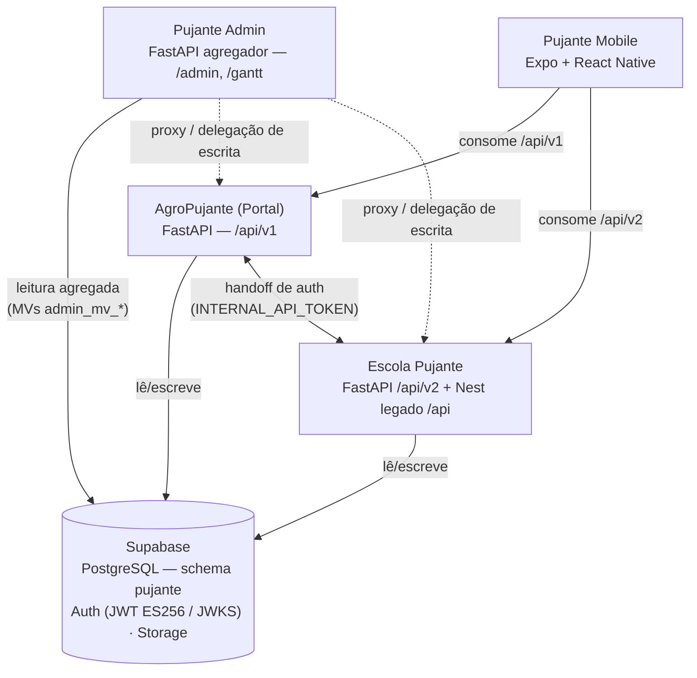
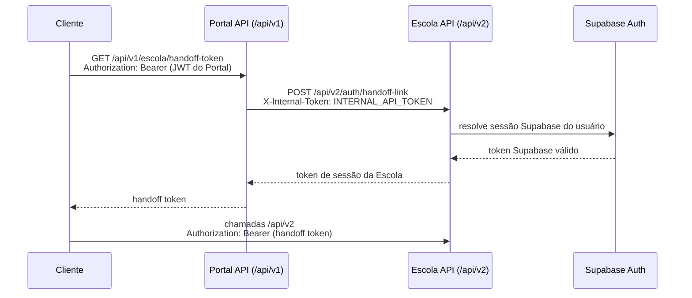

## Visão geral

O ecossistema Pujante é composto por 4 produtos que compartilham infraestrutura central:

## Infraestrutura compartilhada

| Componente | Detalhe |
|------------|---------|
| Banco de dados | Supabase PostgreSQL, schema `pujante` (todos os produtos leem/escrevem no mesmo schema) |
| Autenticação | Supabase Auth emite JWT (ES256); cada backend valida via JWKS público (`/auth/v1/.well-known/jwks.json`) |
| Deploy | Railway (backends e frontends) |
| E-mail | Resend (transacionais) em Portal e Escola |
| Pagamentos | Asaas (PIX, boleto, cartão) em Portal e Escola; PagarMe legado na Escola |

## Conexões entre produtos

### Portal ↔ Escola: handoff de autenticação

Um usuário do Portal com acesso à Escola (`user.escola.has_access`) não precisa logar duas vezes:

<Steps>
  <Step title="Token de handoff">
    O cliente autenticado chama `GET /api/v1/escola/handoff-token` no Portal — veja [Auth & Users do Portal](/agropujante/api/auth-users).
  </Step>
  <Step title="Comunicação interna">
    O backend do Portal chama a Escola via `INTERNAL_API_TOKEN` (header `X-Internal-Token`, `POST /api/v2/auth/handoff-link`) e resolve um token Supabase válido — veja [Auth da Escola](/escola/api/auth).
  </Step>
  <Step title="Sessão na Escola">
    O cliente usa o token retornado como Bearer nas chamadas `/api/v2`.
  </Step>
</Steps>

O Portal também concede trials da Escola via `POST /api/v2/trials/grant` (autenticado com o token interno), e a Escola concede trials do Portal no fluxo inverso.

### Admin → Portal e Escola: agregação e delegação

O Pujante Admin é **read-mostly**: lê direto do schema `pujante` (incluindo materialized views `admin_mv_*`, atualizadas a cada 15 minutos via APScheduler) e **delega escrita** aos backends de origem:

- `POST /admin/launches` roteia para o backend do Portal ou da Escola conforme o `kind` do lançamento (conteúdos editoriais → Portal; aulas/trilhas/eventos → Escola), repassando o Bearer token do admin.
- Os proxies genéricos `/admin/escola/{path}` e `/admin/agropujante/{path}` repassam qualquer chamada autenticada ao upstream correspondente.

### Mobile → Portal e Escola

O app mobile consome as duas APIs com o mesmo padrão Bearer token:

- **Portal** (`/api/v1`): feed, posts, boletins, gamificação, push notifications.
- **Escola** (`/api/v2`): LMS, testes comportamentais, mentoria, Exordial — autenticado via handoff token do Portal ou login direto.

## Migrations no schema compartilhado

O schema `pujante` é um só, mas **cada produto versiona as próprias migrations no próprio repo** (no Portal: `backend/migrations`, convenção `NNN_descricao.sql`). A numeração `NNN` **não é global** — a `017` do Portal não tem relação com a `0017` da Escola. As migrations são aplicadas **à mão no SQL Editor do Supabase, antes do deploy do código** — não há runner automático.

Como o schema é compartilhado, uma migration de um produto pode quebrar outro silenciosamente. Antes de escrever DDL, leia o [guia de migrations do Portal](/agropujante/migrations) e o [checklist de migration segura](/convencoes-banco#checklist-de-migration-segura).

## Entidades que se confundem

O schema compartilhado acumulou pares de nomes parecidos que **não são a mesma coisa**:

| Confusão comum | Realidade |
|----------------|-----------|
| `subscriptions` vs `site_subscriptions` | `subscriptions` + `subscription_payments` + `products` = assinaturas da **Escola**. `site_subscriptions` + `site_subscription_events` = apoiadores do **Portal**. Não se misturam. |
| Jurisprudência vs julgados vs boletins | 3 conceitos do Portal: **consulta de jurisprudência** (`/jurisprudencia`, integração jurisprudencias.ai) ≠ **julgados** (posts editoriais, tipo de `posts`) ≠ **boletins** (PDFs curados — a tabela `julgados` pertence aos boletins, não aos posts). |
| `noticias` vs `noticias_coletadas` | `noticias` (prefixo `noticia_*`) é da **Escola**; `noticias_coletadas` é do **Portal** (pipeline de coleta editorial). |
| `users` vs `members` | Ambas compartilhadas. `users` é o cadastro central (Portal escreve em checkout/assinatura/revenue); `members` vem do mundo Escola/clube de membros. Um mesmo humano pode existir nas duas. |
| `asaas_webhook_events` | Auditoria de webhook Asaas **só existe na Escola**. O Portal processa webhooks Asaas sem tabela de auditoria equivalente. |

Veja o [mapa de propriedade de tabelas](/propriedade-tabelas) para a regra de quem é dono de quê.

## Padrões comuns (matriz por produto)

| | AgroPujante (Portal) | Escola Pujante | Pujante Admin |
|---|---|---|---|
| **Shape de erro** | `{ "detail": "..." }` | `{ "detail": "...", "code": "..." }` | `{ "detail": "..." }` |
| **Paginação** | `page` / `page_size` | `{ data, total, page, limit, totalPages }` | `limit` / `offset` |
| **Auth header** | `Authorization: Bearer <JWT>` (+ `X-Internal-Token` em rotas internas) | `Authorization: Bearer <JWT>` (+ `X-Internal-Token` em rotas internas) | `Authorization: Bearer <JWT>` |
| **Formato de ID** | UUID (`uuid-ossp`) | `text` — CUIDs legados (ex. `clx3k9...`) nas tabelas antigas; UUID nas novas | UUID nas tabelas próprias (`admin_*`, `gantt_*`) |

- **Roles**: cada produto tem seu próprio RBAC sobre o mesmo cadastro de usuários — veja a página de autenticação de cada produto.

<Warning>
As migrations do schema `pujante` são aplicadas manualmente no SQL Editor do Supabase antes do deploy — não há runner automático. Mudanças de schema afetam todos os produtos ao mesmo tempo.
</Warning>
