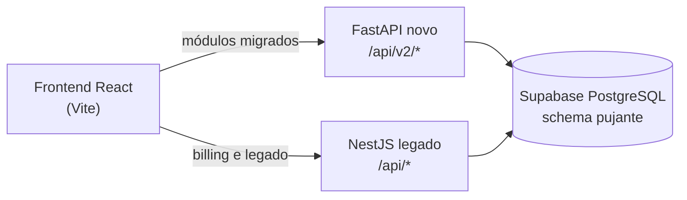

## Padrão strangler

A Escola Pujante convive com dois backends durante a migração:



| Backend | Prefixo | Status | Responsabilidades |
|---|---|---|---|
| FastAPI (novo) | `/api/v2` | Em expansão | Toda a API documentada nesta seção |
| NestJS (legado) | `/api` | Em extinção gradual | Billing (PagarMe/Asaas), alguns webhooks e operações pesadas |

O frontend troca o prefixo das chamadas gradualmente de `/api` para `/api/v2`, módulo a módulo. Quando um módulo migra por completo, o equivalente legado é desligado.

<Warning>
Antes de remover qualquer rota do NestJS, confirme que o frontend já não a consome e que o equivalente em `/api/v2` está implementado (alguns endpoints v2 ainda retornam **501 — não implementado** como stub).
</Warning>

## Estrutura de pastas do backend

O FastAPI segue separação por camada, com um router por domínio:

```text
backend/app/
├── routers/    # 1 router por domínio (auth, users, lms, subscriptions, ...)
├── services/   # regra de negócio e acesso a dados (PostgREST)
├── schemas/    # modelos Pydantic de request/response
└── core/       # auth (JWKS), exceptions, cliente Supabase
```

- **Routers** apenas declaram rotas, validam input e delegam.
- **Services** concentram a lógica e falam com o Supabase via PostgREST (não há ORM).
- **Schemas** Pydantic 2 definem os contratos de entrada e saída.
- **Core** centraliza validação de JWT, exceções padronizadas e o client do Supabase.

## Padrão de resposta

<Tabs>
  <Tab title="Sucesso">
    Objetos retornam os campos diretamente, sem envelope:

    ```json
    { "id": "abc123", "name": "Fulano", "status": "ACTIVE" }
    ```
  </Tab>
  <Tab title="Listagem paginada">
    ```json
    {
      "data": [],
      "total": 120,
      "page": 1,
      "limit": 20,
      "totalPages": 6
    }
    ```
  </Tab>
  <Tab title="Erro">
    Status HTTP adequado + `{detail, code}` do handler global:

    ```json
    { "detail": "Acesso restrito", "code": "http_error" }
    ```

    Tabela completa de codes e exceções em [Convenções da API](/escola/convencoes).
  </Tab>
</Tabs>

<Note>
Endpoints ainda não migrados respondem **`501 Not Implemented`**. Nesta documentação eles aparecem marcados como "não implementado".
</Note>

## Rate limiting

A dependência **slowapi** está declarada e o limite é configurável via `RATE_LIMIT_PER_MINUTE` (padrão: **60 requisições/minuto**).

<Note>
O limiter global ainda não está registrado no `main.py` — hoje a proteção efetiva é por endpoint: o fluxo de password reset limita solicitações por email (3/hora) e tentativas por código OTP (5), respondendo `429 Too Many Requests` quando excedido. Detalhes em [Convenções da API](/escola/convencoes).
</Note>

## Scheduler

Jobs recorrentes rodam com **APScheduler** in-process, desenhados para serem **idempotentes** — uma execução repetida não duplica efeitos (imports de gateway, reconciliações, etc.).

## Observabilidade

- **Logging**: stdout estruturado.
- **APM**: New Relic (`NEWRELIC_LICENSE_KEY`).
- **Webhooks auditados**: todo evento recebido de gateway é persistido em tabelas `*_webhook_events` (`asaas_webhook_events`, `pagarme_webhook_events`) antes do processamento, permitindo replay e diagnóstico.

## OpenAPI

O FastAPI gera a especificação automaticamente, mas **somente com `DEBUG=true`** (desativado em produção):

| Recurso | Path |
|---|---|
| Especificação JSON | `/api/openapi.json` |
| Swagger UI | `/api/docs` |
| ReDoc | `/api/redoc` |
