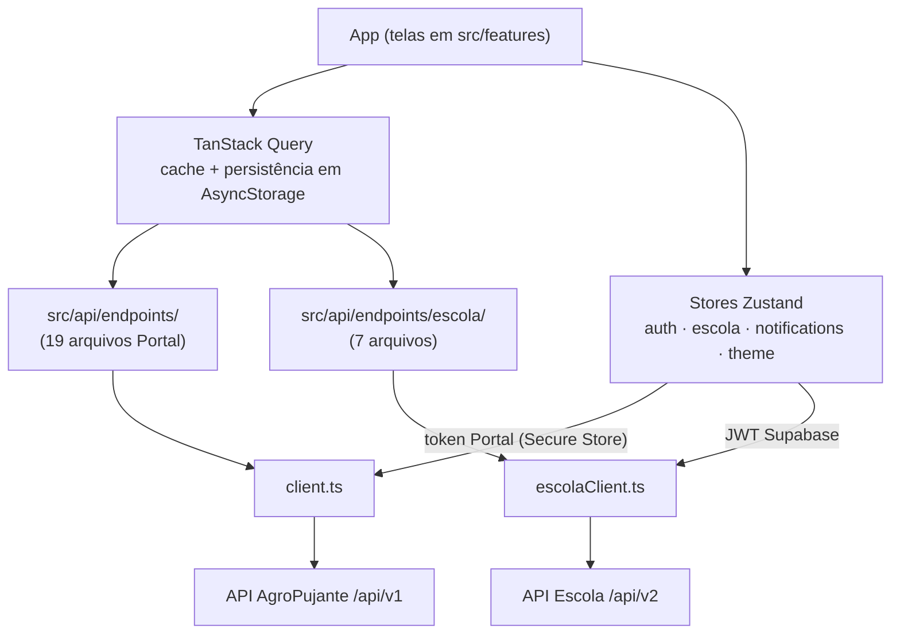

## Estrutura de pastas

```
src/
├── api/
│   ├── client.ts          # client HTTP do Portal (/api/v1)
│   ├── escolaClient.ts    # client HTTP da Escola (/api/v2)
│   ├── endpoints/         # 19 arquivos — endpoints do AgroPujante
│   │   └── escola/        # 7 arquivos — endpoints da Escola
├── features/              # 22 módulos de feature
│   └── <feature>/
│       ├── components/
│       ├── hooks/
│       └── screens/
├── stores/                # Zustand: auth, escola, notifications, theme
└── ...
app/                       # rotas Expo Router (file-based)
```

## Fluxo de dados



## Dois clients, dois mundos

O app mantém clients HTTP separados porque os backends têm autenticação e ciclo de vida de sessão distintos:

<Tabs>
  <Tab title="client.ts (Portal)">
    Aponta pra API do AgroPujante (`/api/v1`). Injeta o Bearer token da store `auth`, lido do Expo Secure Store. Centraliza tratamento de erro e serialização.
  </Tab>
  <Tab title="escolaClient.ts (Escola)">
    Aponta pra API da Escola (`/api/v2`). Injeta o JWT Supabase da store `escola`, obtido via handoff ou login manual. Sessão independente da do Portal.
  </Tab>
</Tabs>

Os arquivos em `src/api/endpoints/` são finos: cada um agrupa as funções de um domínio (posts, users, likes...) e tipa request/response. Os 7 arquivos de `endpoints/escola/` seguem o mesmo padrão usando o `escolaClient`.

## Padrão feature module

Cada um dos 22 módulos em `src/features/` é autocontido:

- **`components/`** — componentes visuais específicos da feature.
- **`hooks/`** — hooks de dados (TanStack Query) e de lógica local.
- **`screens/`** — telas completas, importadas pelas rotas em `app/`.

<Note>
  As rotas em `app/` (Expo Router) são apenas casca: resolvem params e renderizam a screen da feature. A lógica vive no feature module — isso mantém o roteamento declarativo e as features testáveis isoladamente.
</Note>

## Configuração de base URLs

As URLs dos backends ficam em `app.json`, dentro de `expo.extra` — **só o host**, sem path. Os sufixos `/api/v1` e `/api/v2` são concatenados em `src/constants/env.ts`:

```json
{
  "expo": {
    "extra": {
      "apiUrl": "https://api.agropujante.com.br",
      "escolaApiUrl": "https://api.escolapujante.com.br"
    }
  }
}
```

| Chave | Backend | Observação |
|---|---|---|
| `apiUrl` | AgroPujante `/api/v1` | Produção por padrão |
| `escolaApiUrl` | Escola `/api/v2` | Em dev local troca pro IP da máquina na rede, ex. `http://192.168.0.10:8765` (Expo Go não resolve `localhost` — veja o [Quickstart](/mobile/quickstart#apontando-pra-uma-api-local)) |

<Warning>
  Ainda não existe esquema de `.env` por ambiente — trocar de dev pra produção hoje exige editar o `app.json` manualmente. Essa pendência está documentada em [Build e deploy](/mobile/build-deploy).
</Warning>
