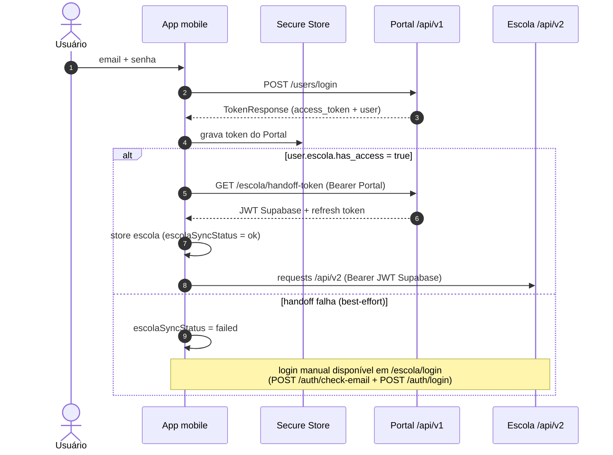

O app tem duas sessões independentes: a do **Portal** (token nativo do AgroPujante) e a da **Escola** (JWT Supabase). O usuário só digita a senha uma vez — a sessão da Escola é derivada da do Portal via handoff.

<Info>
  Os contratos completos dos endpoints envolvidos estão nas referências de API: [login e handoff-token do Portal](/agropujante/api/auth-users), [check-email e login da Escola](/escola/api/auth). Pra visão geral do handoff entre os produtos, veja [Ecossistema](/ecossistema).
</Info>

## Login no Portal

<Steps>
  <Step title="Credenciais">
    O usuário envia email e senha em `POST /users/login`.
  </Step>
  <Step title="TokenResponse">
    A API responde com `TokenResponse`: `access_token` + objeto `user`.
  </Step>
  <Step title="Persistência segura">
    O token vai pro **Expo Secure Store** (Keychain/Keystore). No web, cai em `localStorage`.
  </Step>
  <Step title="Handoff Escola (condicional)">
    Se `user.escola.has_access` for `true`, o app dispara o handoff pra Escola (abaixo).
  </Step>
</Steps>

## Hidratação no cold start

Ao abrir o app, a store `auth` lê o token do Secure Store e valida a sessão chamando `GET /users/me`:

- **200** — usuário atualizado na store, app segue logado.
- **401** — **logout silencioso**: token descartado, usuário cai no fluxo de login sem mensagem de erro intrusiva.

<Warning>
  **Não há refresh automático de token** ainda. Quando o token do Portal expira, o usuário precisa logar de novo. Refresh token é future work mapeado — veja [pendências](/mobile/build-deploy#pendências).
</Warning>

## Handoff pra Escola

Quando o usuário tem acesso à Escola, o app troca a sessão do Portal por uma sessão Supabase da Escola, sem segundo login:

<Steps>
  <Step title="Verificação de acesso">
    Após login ou hidratação, o app checa `user.escola.has_access`.
  </Step>
  <Step title="Troca de token">
    Chama `GET /escola/handoff-token` (autenticado com o token do Portal) e recebe um token Supabase + refresh token da Escola. Contrato completo em [API: auth e usuários](/agropujante/api/auth-users).
  </Step>
  <Step title="Sessão da Escola">
    Os tokens entram na store `escola` e passam a autenticar o `escolaClient` (`/api/v2`).
  </Step>
</Steps>

O handoff é **best-effort**: falha no handoff não derruba o login do Portal. O resultado fica registrado em `escolaSyncStatus`:

| Status | Significado |
|---|---|
| `ok` | Handoff concluído, sessão da Escola ativa |
| `failed` | Handoff tentado e falhou — usuário pode logar manualmente em `/escola/login` |
| `skipped` | Usuário sem `escola.has_access`, handoff nem foi tentado |

<Note>
  Se o handoff falhar (`failed`), o módulo Escola oferece login manual em `/escola/login`, que usa `POST /auth/check-email` + `POST /auth/login` da API `/api/v2` — contratos em [Escola: Auth](/escola/api/auth).
</Note>

## Logout

O logout limpa **tudo**, nas duas sessões:

1. Remove o push token do backend (`DELETE /devices?token=`), best-effort.
2. Limpa a store `auth` e o token do Portal no Secure Store.
3. Limpa a store `escola` (tokens Supabase, perfil, `escolaSyncStatus`).
4. Reseta caches sensíveis ao usuário no TanStack Query.

## Cadastro e recuperação de senha

| Fluxo | Endpoints |
|---|---|
| Cadastro | `POST /users/register` (nome, email, senha, aceite de termos) |
| Esqueci a senha | `POST /users/password-reset/request` → OTP por email |
| Verificação do OTP | `POST /users/password-reset/verify` → `reset_token` válido por 5 minutos |
| Nova senha | `POST /users/password-reset/confirm` |

<Note>
  A requisição de reset retorna resposta genérica independentemente do email existir ou não — a API não vaza existência de conta. Os contratos completos desses fluxos estão em [API: auth e usuários](/agropujante/api/auth-users).
</Note>
