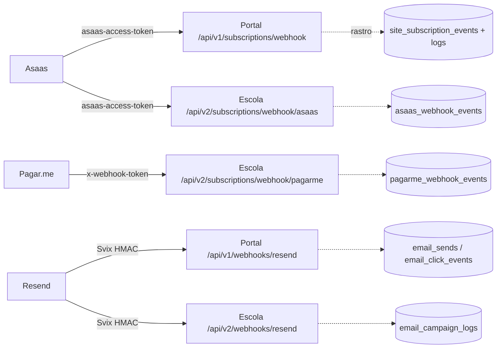

Esta página é o inventário do que roda em produção. Use-a como ponto de partida quando precisar localizar um serviço, conferir a URL de um webhook ou descobrir qual job deveria ter rodado.

## Serviços

| Produto | Serviço | Stack | Domínio | Repo (GitHub) | Health |
|---|---|---|---|---|---|
| Portal AgroPujante | API (`/api/v1`) | FastAPI (`backend/app`) | `api.agropujante.com.br` | [AgroPujante/AgroPujante](https://github.com/AgroPujante/AgroPujante) | `GET /health` |
| Portal AgroPujante | Web | Vite + React | `agropujante.com.br` | [AgroPujante/AgroPujante](https://github.com/AgroPujante/AgroPujante) | — |
| Escola Pujante | API (`/api/v2`) | FastAPI (`backend/app`) | `api.escolapujante.com.br` | [AgroPujante/Escola-Pujante](https://github.com/AgroPujante/Escola-Pujante) | `GET /health` |
| Escola Pujante | Web | React (template Tailux) | `escolapujante.com.br` | [AgroPujante/Escola-Pujante](https://github.com/AgroPujante/Escola-Pujante) | — |
| Escola Pujante | Legado (strangler) | NestJS | `<preencher: domínio do Nest legado>` | `<preencher: repo do Nest legado>` | `<preencher>` |
| Pujante-Admin | API | FastAPI (`backend/app`) | `<preencher: domínio do backend do Admin no Railway>` | [AgroPujante/Pujante-Admin](https://github.com/AgroPujante/Pujante-Admin) | `GET /health` e `GET /health/deep` |
| Pujante-Admin | Web | React 19 + Vite + Tailwind v4 | `<preencher: domínio do frontend do Admin>` | [AgroPujante/Pujante-Admin](https://github.com/AgroPujante/Pujante-Admin) | — |

<Note>
Os domínios marcados com `<preencher: ...>` só existem na configuração do Railway (não estão documentados em código). Preencha consultando o painel do Railway → serviço → Settings → Networking.
</Note>

Banco: Supabase compartilhado, schema `pujante` (o PostgREST exige header `Accept-Profile: pujante` — o schema `public` não é usado).

## Webhooks registrados

| Origem | URL exata | Validação | Auditoria | Onde reconfigurar |
|---|---|---|---|---|
| Asaas → Portal | `POST https://api.agropujante.com.br/api/v1/subscriptions/webhook` | Header `asaas-access-token` (compara com `ASAAS_WEBHOOK_TOKEN`) | **Não há tabela de auditoria de webhook** — rastro indireto em `site_subscription_events` + logs do Railway | Painel Asaas → Integrações → Webhooks |
| Resend → Portal | `POST https://api.agropujante.com.br/api/v1/webhooks/resend` | Assinatura Svix HMAC (`RESEND_WEBHOOK_SECRET`, headers `svix-id`/`svix-timestamp`/`svix-signature`) | Eventos gravados em `email_sends` / `email_click_events` | Painel Resend → Webhooks |
| Asaas → Escola | `POST https://api.escolapujante.com.br/api/v2/subscriptions/webhook/asaas` | Header `asaas-access-token` (compara com `ASAAS_WEBHOOK_TOKEN`) | `asaas_webhook_events` | Painel Asaas → Integrações → Webhooks |
| Pagar.me → Escola | `POST https://api.escolapujante.com.br/api/v2/subscriptions/webhook/pagarme` | Header `x-webhook-token`, validado **somente se** `PAGARME_WEBHOOK_TOKEN` estiver configurado (historicamente o Pagar.me não envia token) | `pagarme_webhook_events` | Painel Pagar.me → Webhooks |
| Resend → Escola | `POST https://api.escolapujante.com.br/api/v2/webhooks/resend` | Assinatura Svix HMAC | `email_campaign_logs` | Painel Resend → Webhooks |

<Warning>
Os endpoints de webhook respondem `200` mesmo quando o processamento interno falha (para evitar retry infinito do gateway). "Webhook entregue" no painel do gateway **não** significa "pagamento processado" — confira a auditoria/logs. Veja [troubleshooting](/operacao/troubleshooting).
</Warning>

## Schedulers (APScheduler in-process)

Todos os jobs rodam **dentro do processo da API** (APScheduler) — não há cron externo. Se o serviço estiver fora do ar no horário do job, o job não roda (cada job tem uma janela de tolerância, `misfire_grace_time`).

### Portal AgroPujante (`backend/app/core/scheduler.py`, horários em UTC)

| Job (id) | Quando | O que faz | Última execução |
|---|---|---|---|
| `daily_digest_emails` | Diário 10:00 | Digest de posts de ontem por categoria seguida | `scheduled_job_runs` (`job_id = 'daily_digest'`) |
| `nps_invitations` | Diário 10:30 | Convites NPS (D+7 e quarterly) | `scheduled_job_runs` |
| `expire_profile_completion_trials` | Diário 11:00 | Expira trials profile_completion vencidos | `scheduled_job_runs` |
| `profile_completion_trial_reminders` | Diário 11:30 | Lembrete D-1 de fim de trial | `scheduled_job_runs` |
| `trial_completion_nps` | Diário 11:45 | NPS de fim de trial-recompensa | `scheduled_job_runs` |
| `noticias_coleta` | Diário 11:00 e 21:00 | Coleta + triagem GPT de notícias jurídicas | `scheduled_job_runs` (`noticias_coleta_morning`/`_evening`) |
| `noticias_digest` | Diário 12:00 | Digest editorial das notícias triadas | `scheduled_job_runs` |
| `reconcile_pending_redemptions` | Diário 13:00 | Reconcilia resgates pendentes >24h (webhook Asaas que não chegou) | `scheduled_job_runs` |
| `reconcile_balance_drift` | Diário 13:30 | Detecta drift saldo × ledger (só reporta, não corrige) | `scheduled_job_runs` |
| `external_calendar_sync` | A cada hora (:00) | Sync da agenda externa (Firebase) | `external_calendar_sync_runs` |
| `youtube_podcasts_sync` | A cada hora (:30) | RSS do YouTube → tabela `podcasts` (insert-only) | Logs do Railway |
| `expire_stale_redemptions` | A cada 1 min | TTL de `coin_redemptions` pendentes (loga heartbeat a cada tick) | Logs do Railway |
| `monthly_ranking_snapshots` | Dia 1, 06:00 | Snapshots do ranking do mês anterior | Logs do Railway |
| `monthly_retrospective_emails` | Dia 1, 12:00 | Retrospectivas mensais por e-mail (PDF) | `scheduled_job_runs` |
| `prune_page_views` | Dia 1, 03:00 | Apaga `page_views` com mais de 12 meses | `scheduled_job_runs` |

<Note>
Os jobs de e-mail do Portal usam *claim* atômico em `scheduled_job_runs` (UNIQUE em `job_id + run_date`) para não disparar duplicado quando o uvicorn roda com múltiplos workers. Consulte essa tabela para ver status, `stats` e `error_message` da última execução.
</Note>

### Escola Pujante (`backend/app/core/scheduler.py`, horários em America/Sao_Paulo)

| Job (id) | Quando | O que faz | Última execução |
|---|---|---|---|
| `reconciliation_daily` | Diário 03:00 BRT | Reconciliação: mismatch de `is_subscriber`, pagamentos Pagar.me órfãos, assinaturas pausadas stale | Logs do Railway (`scheduler: reconciliation OK ...`) |
| `expire_escola_trials_hourly` | A cada hora (:15) | Expira trials da Escola vencidos (ex.: 7 dias concedidos pelo PRO Anual) | Logs do Railway (`scheduler: expire_due_trials OK ...`) |

### Pujante-Admin (`backend/app/core/scheduler.py`, UTC; liga/desliga via `SCHEDULER_ENABLED`)

| Job (id) | Intervalo (env) | O que faz | Última execução |
|---|---|---|---|
| `refresh_admin_mvs` | `MV_REFRESH_MINUTES` (default **15**) | Refresh de todas as MVs `admin_mv_*` (concurrent) | `GET /admin/mvs` (lista MVs com metadados) e `GET /admin/system/health` (seção jobs) |
| `meta_ads_sync` | `META_SYNC_INTERVAL_MINUTES` (default **60**) | Sync de insights da Meta Marketing API | Logs do Railway; se as envs `META_*` estiverem vazias o job não faz nada (opt-in) |

<Tip>
Dados do dashboard do Admin podem estar até `MV_REFRESH_MINUTES` (15 min) defasados por design. Para forçar: `POST /admin/mvs/refresh?concurrent=true`.
</Tip>

## Branches e deploy

- **Deploy é via Railway com auto-deploy**: push na branch conectada ao serviço dispara build e deploy automaticamente. Não há etapa manual de release.
- **Migrations NÃO rodam no deploy** — são aplicadas à mão no SQL Editor do Supabase, **antes** de subir o código. Veja [migrations do AgroPujante](/agropujante/migrations).

<Warning>
**Escola Pujante: `main` e `staging` divergiram.** A `staging` acumulou ~220 commits do Portal do Professor e a `main` ~44 hotfixes de produção. **Não promova `staging` → `main` cegamente.** Para levar algo a produção, faça cherry-pick isolado a partir da `main`.
</Warning>

<CardGroup cols={2}>
  <Card title="Troubleshooting" icon="bug" href="/operacao/troubleshooting">
    Sintomas comuns e onde olhar primeiro.
  </Card>
  <Card title="Observabilidade" icon="chart-line" href="/operacao/observabilidade">
    Logs, APM e tabelas de auditoria de cada produto.
  </Card>
</CardGroup>
