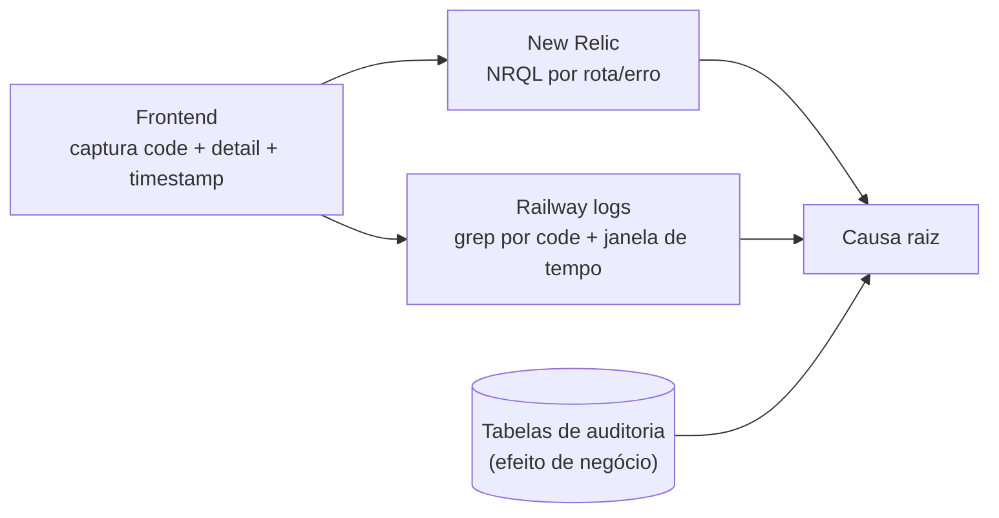

<Tip>
**Primeiro lugar para olhar: `GET /admin/system/health`** (Pujante-Admin). Ele consolida status dos gateways de pagamento, falhas de webhook (`webhook_failures`), estado dos jobs e latência — antes de sair caçando log, comece por aí.
</Tip>

## Onde está o log de cada produto

| Produto | APM (New Relic) | Logs de runtime | Atalho via Admin |
|---|---|---|---|
| Portal AgroPujante | App name definido por `NEW_RELIC_APP_SITE` no Admin (default `AgroPujante SiteAPI`) | Railway → serviço do backend do Portal → aba Logs | `GET /admin/observability/logs`, `/metrics`, `/error-occurrences` (origin `site`) |
| Escola Pujante | App name definido por `NEW_RELIC_APP_ESCOLA` no Admin (default `Escola Pujante API`) | Railway → serviço do backend da Escola → aba Logs | Mesmos endpoints, origin `escola` |
| Pujante-Admin | — (o Admin consome o New Relic, não é monitorado por ele) | Railway → serviço do backend do Admin → aba Logs | — |

<Note>
Os endpoints `/admin/observability/*` consultam o New Relic via NerdGraph (NRQL) usando a **User key** (`NEW_RELIC_USER_KEY` + `NEW_RELIC_ACCOUNT_ID`). É **opt-in**: com as envs vazias, a tela mostra aviso e retorna vazio — não é bug.
</Note>

## Correlação frontend ↔ backend

As APIs retornam erro no formato padrão:

```json
{ "detail": "mensagem legível", "code": "CODIGO_DO_ERRO" }
```

Ao reportar/investigar um erro visto no frontend, **capture sempre `code` + `detail`** (e o horário) — o `code` é o que você vai grepar no backend.

<Warning>
**Não há request-id propagado hoje.** Nenhum header tipo `X-Request-Id` atravessa frontend → backend → logs, então a correlação é feita por **timestamp + rota + code** — imprecisa em rotas de alto tráfego. Recomendação em aberto: adotar `X-Request-Id` gerado no frontend (ou no edge), propagado nos clients HTTP e incluído em todo log estruturado.
</Warning>



## Tabelas canônicas de auditoria

Todas no schema `pujante`. Via API REST do Supabase, use o header `Accept-Profile: pujante`; via SQL, qualifique `pujante.<tabela>`.

| Tabela | Produto | O que registra |
|---|---|---|
| `admin_activity_log` | Admin | Toda ação de admin no painel (quem, o quê, quando) |
| `asaas_webhook_events` | Escola | Cada webhook do Asaas recebido: payload, status de processamento, erro |
| `pagarme_webhook_events` | Escola | Idem para Pagar.me |
| `site_subscription_events` | Portal | Eventos do ciclo de vida das assinaturas do Portal (único rastro de webhook Asaas no Portal) |
| `email_sends` | Portal | Cada e-mail disparado (destinatário, template, status) |
| `email_click_events` | Portal | Cliques em e-mails (via webhook Resend) |
| `email_campaign_logs` | Escola | Envios/eventos de e-mail da Escola (via webhook Resend) |
| `password_reset_codes` | Portal | Códigos de reset de senha emitidos (diagnóstico de "não recebi o código") |
| `scraper_logs` | Escola | Execuções dos scrapers |
| `bling_automation_logs` | Escola | Execuções da automação Bling (NF/estoque) |

Exemplos de consulta:

```sql
-- Últimos webhooks Asaas da Escola com falha
SELECT * FROM pujante.asaas_webhook_events
ORDER BY created_at DESC LIMIT 20;

-- Trilha de assinatura de um usuário no Portal
SELECT * FROM pujante.site_subscription_events
WHERE user_id = '<user_id>'
ORDER BY created_at DESC;
```

```bash
# Via REST (Supabase) — o header Accept-Profile é obrigatório
curl "https://<projeto>.supabase.co/rest/v1/email_sends?order=created_at.desc&limit=20" \
  -H "apikey: <SUPABASE_ANON_KEY>" \
  -H "Authorization: Bearer <token>" \
  -H "Accept-Profile: pujante"
```

## Execução de jobs

- **Portal:** `scheduled_job_runs` (status, `stats`, `error_message` por job/dia) e `external_calendar_sync_runs` para o sync de agenda. Jobs sem run-tracking (ex.: `expire_stale_redemptions`, que loga heartbeat por minuto) só aparecem nos logs do Railway.
- **Escola:** apenas logs do Railway (`scheduler: reconciliation OK ...`, `scheduler: expire_due_trials OK ...`).
- **Admin:** `GET /admin/mvs` (estado das MVs) e `GET /admin/system/health` (seção jobs).

Lista completa de jobs e horários no [mapa de produção](/operacao/mapa-producao#schedulers-apscheduler-in-process).

<Card title="Troubleshooting" icon="bug" href="/operacao/troubleshooting">
  Já sabe onde está o log? Cruze com os sintomas comuns para chegar na causa.
</Card>
